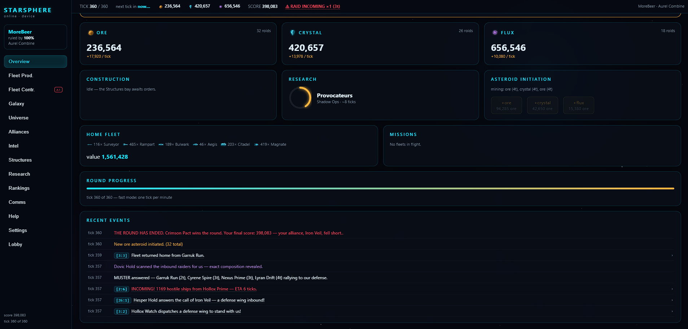
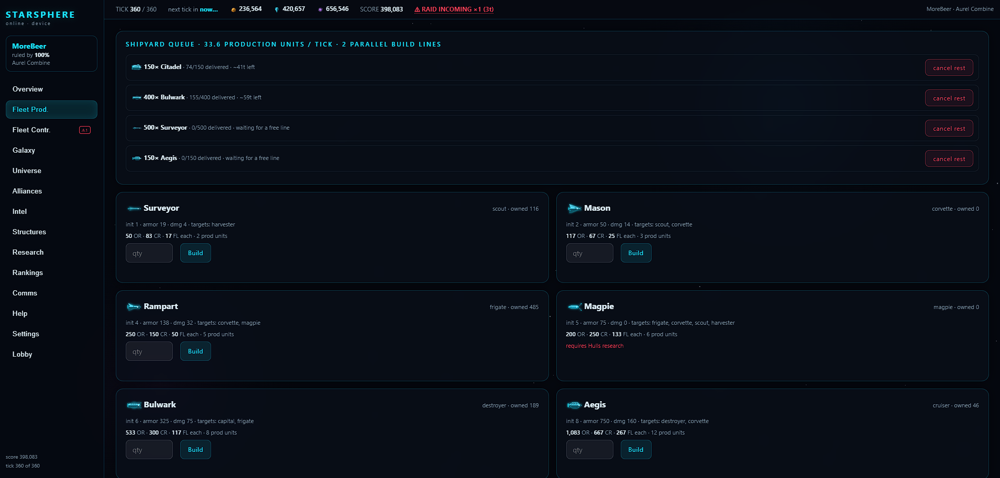
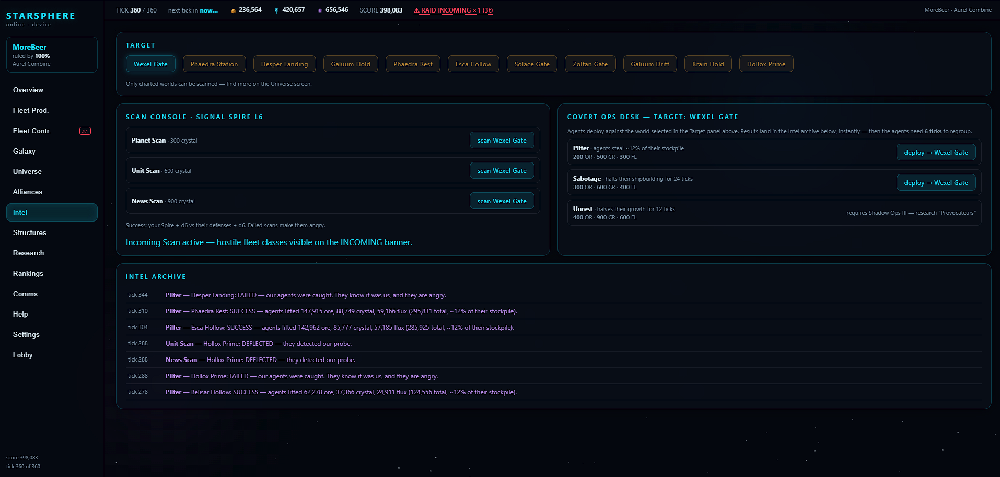
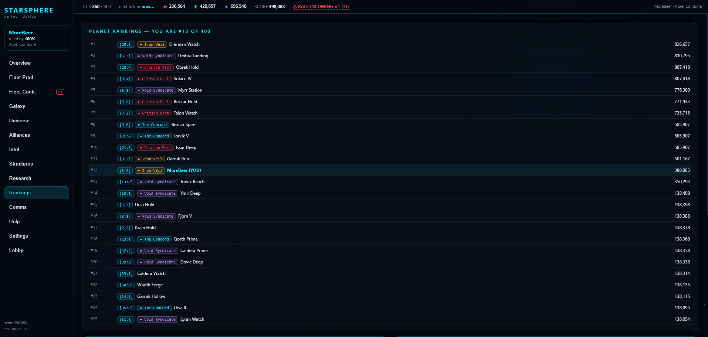
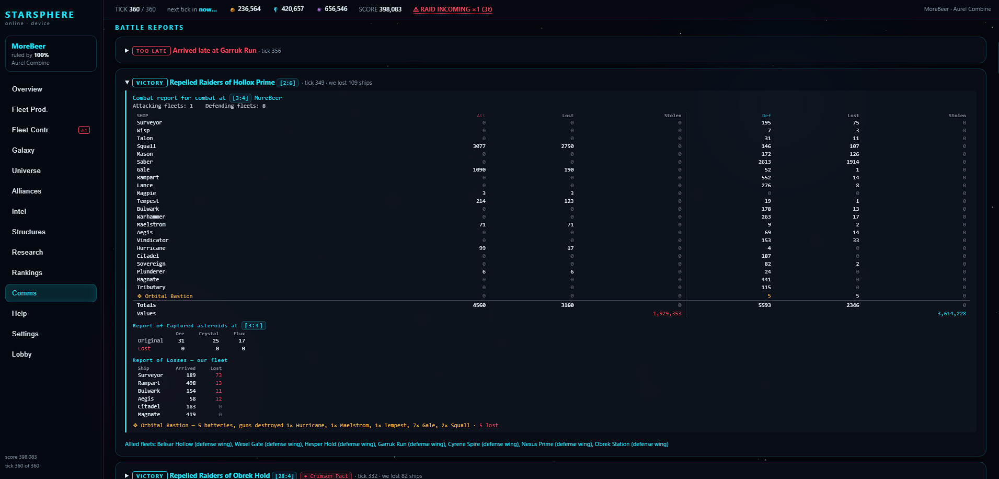

# STARSPHERE ONLINE

A multiplayer space-strategy game. Up to **8 commanders share the home
cluster** of one persistent universe — mine asteroids, build a fleet,
climb the tech tree, and outgrow 199 AI rivals across 25 clusters. The
server keeps every universe **ticking whether anyone is watching or
not**, so the galaxy lives on while you sleep. Accounts, 6-letter invite
codes, and SQLite persistence are built in.

<p align="center">
  
  <br>
  <sub><i>The command dashboard — resources, construction, research, and a live event feed.</i></sub>
</p>

<table>
  <tr>
    <td width="50%" valign="top">
      
      <br><sub><b>Fleet &amp; shipyard</b> — parallel build lines and the full ship roster, each with initiative, armor, damage, and counters.</sub>
    </td>
    <td width="50%" valign="top">
      
      <br><sub><b>Intel</b> — scan a rival's planet and fleet, run covert ops, and watch for incoming raids.</sub>
    </td>
  </tr>
  <tr>
    <td width="50%" valign="top">
      
      <br><sub><b>Rankings</b> — your standing against every empire in the universe.</sub>
    </td>
    <td width="50%" valign="top">
      
      <br><sub><b>Battle report</b> — raids resolved class by class, attacker against defender.</sub>
    </td>
  </tr>
</table>

---

## The game

You rule one planet. Every **tick** your asteroids produce resources,
your construction and research queues advance, and any fleets in flight
move one step closer. A standard round runs **1008 ticks**; you win by
out-building and out-fighting everyone else before it ends.

### Resources

| Resource | Mined from | Used for |
|---|---|---|
| **Ore** | Ore asteroids | The bulk of every building and ship |
| **Crystal** | Crystal asteroids | Tech, advanced hulls, scanning |
| **Flux** | Flux asteroids | Capital ships, covert ops, high-tech gear |

Claim more asteroids to raise income; each additional roid costs more
than the last, so expansion is a constant trade-off against military.

### Factions

Pick a faction when you found or join a round — each bends the game a
different way:

| Faction | Identity | Perk |
|---|---|---|
| **Aurel Combine** | Industrial builders | Construction −20%, +25% ship armor |
| **Vexari Corsairs** | Fast raiders | All fleet ETAs −1, −15% armor, +10% light-ship damage |
| **Mistveil Syndicate** | Spies & thieves | Magpie steal +20%, free signal amp & distorter |
| **Korvan Hegemony** | Heavy warfleet | +20% ship damage, +15% ship cost |

### Buildings

Ten structures, each up to **level 10** — economy (Ore Refinery, Crystal
Array, Flux Siphon), the **Shipyard** (level 6 unlocks a second build
line), the **Astro Lab** (research), intelligence (Signal Spire, Static
Veil, Watch Bureau), and defense (Deep Vault to protect your stockpile,
Orbital Bastion for static guns).

### Research — five trees

| Tree | What it buys |
|---|---|
| **Propulsion** | Faster fleet ETAs (10 → 5) |
| **Hulls** | Unlock bigger ships: Corvette → Frigate → Destroyer → Cruiser → Capital |
| **Extraction** | More income per asteroid + extra construction slots |
| **Signals** | Scanning: planet, fleet, news, incoming-fleet detection |
| **Shadow Ops** | Covert ops (Pilfer, Sabotage, Unrest) + the Magpie thief ship |

### The fleet

Eight ship classes form an **initiative-and-counter** chain — each
targets specific enemy classes, so composition matters as much as raw
size:

| Class | Role |
|---|---|
| **Scout** | Cheap eyes; hunts harvesters |
| **Corvette** | Light line ship |
| **Frigate** | Mid-weight; kills corvettes & magpies |
| **Magpie** | Thief — steals enemy ships instead of dealing damage |
| **Destroyer** | Heavy; hunts capitals & frigates |
| **Cruiser** | Heavier still |
| **Capital** | The apex hull — late-game payoff |
| **Harvester** | Non-combat miner |

Every faction flies the same classes under its own ship names (the Aurel
*Citadel*, the Vexari *Hurricane*, the Korvan *Sovereign*…).

### Conflict & intrigue

- **Raids** send a fleet across the map; combat resolves by initiative
  order and counter-matchups, with Magpies grappling ships home instead
  of destroying them.
- **Scans** reveal a rival's planet, fleet, news, or the fleets inbound
  to your own galaxy — countered by Static Veil.
- **Covert ops** — Pilfer, Sabotage, Unrest — run through Shadow Ops;
  the Watch Bureau improves your odds of catching enemy agents.
- **Raid protection:** every commander gets a **72-tick** shield from the
  moment they join, so late arrivals aren't farmed on sight.

### Round formats

| Format | Length | Protection | Notes |
|---|---|---|---|
| **Standard** | 1008 ticks | 72 | The full game |
| **Blitz** | 360 ticks | 24 | ×1.6 research, empires start a few rungs up — fast hulls, capitals still a late payoff |

### Difficulty

| Level | AI rivals | Economy | Raid pressure |
|---|---|---|---|
| **Chill** | 4 | ×0.70 | ×0.70 |
| **Normal** | 10 | ×1.00 | ×1.00 |
| **Brutal** | 18 | ×1.35 | ×1.40 |

### Tick pace

Choose when you create a round:

- **Fast** — frequent ticks, a brisk session.
- **Authentic** — ~1 tick/hour, a slow-burn game you check on over days.

---

## Run it

```bash
cd sphere
./start.sh           # installs deps on first run, listens on http://localhost:8777
                     # auto-restarts if the server crashes; PORT=9000 ./start.sh for another port
./start.sh --tunnel  # additionally opens a public https URL (cloudflared quick tunnel)
                     # and prints it — share that link with friends, works on phones
```

(Or manually: `npm install` once, then `npm start`.) The `--tunnel` URL is
ephemeral — each start gets a new one. Accounts and universes live in
`sphere.db` on this machine, so a changing URL loses nothing.

Open http://localhost:8777 — register, then either **create a round**
(pick the tick pace, faction, difficulty, and format; you get a 6-letter
invite code) or **join a friend's round** with their code. Joiners take
home-cluster slots in order; unfilled slots stay AI.

All state lives in **`sphere.db`** (SQLite, WAL mode) — back up that one
file and you've backed up every universe.

- `PORT=1234 npm start` — change the port.
- `DEV_TICK=1 npm start` — enables `POST /api/dev/tick {id, n}` to
  fast-forward a game while testing. Never run this in production.

### Playing with friends over the internet

**ngrok (quickest):**
```bash
npm start            # terminal 1
ngrok http 8777      # terminal 2 — share the https URL it prints
```

**VPS (the real deal):** copy this folder, `npm install`, then keep it
alive with systemd:

```ini
# /etc/systemd/system/starsphere.service
[Unit]
Description=STARSPHERE ONLINE
After=network.target

[Service]
WorkingDirectory=/opt/starsphere
ExecStart=/usr/bin/node server.js
Restart=always
Environment=PORT=8777

[Install]
WantedBy=multi-user.target
```

Put nginx/caddy in front for HTTPS if you want browser notifications to
work away from localhost.

---

## How it's put together

| File | Role |
|---|---|
| `game.js` | All game rules as pure functions over a universe object — the single source of truth, runs only on the server. |
| `server.js` | Express + better-sqlite3: accounts (scrypt-hashed passwords), sessions, invite codes, lazy tick catch-up on every request plus a 5s background pump. |
| `public/index.html` | The client — rendering is identical to single-player; persistence and actions go through `/api`. |
| `make-client.py` | Regenerates `public/index.html` from the single-player `starsphere.html`. |

The client polls game state every 5 seconds and re-renders only when the
tick advances; a Server-Sent-Events stream pushes instant updates on
ticks and other players' actions. **Every action is validated
server-side — the browser is just a viewer.**

## Security & data

Passwords are **scrypt-hashed** with per-user salts; sessions are random
crypto tokens. There are no third-party API keys. The local database
(`sphere.db` and its WAL sidecars) holds real accounts and live session
tokens and is **git-ignored** — never commit it.
